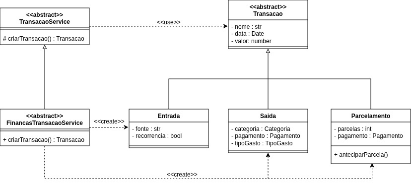
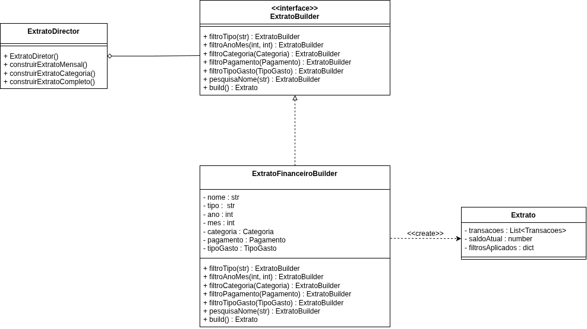

# 3.1. Módulo Padrões de Projeto GoFs Criacionais

## Introdução

Padrões de Projeto Criacionais (GoF) tratam do **processo de criação de objetos**, abstraindo a lógica de instanciação para tornar o sistema independente de como seus objetos são criados, compostos e representados. Segundo Gamma et al. (1994), os padrões criacionais "encapsulam o conhecimento sobre quais classes concretas o sistema utiliza" e "ocultam como instâncias dessas classes são criadas e compostas".

No contexto do projeto **Finanças**, dois padrões criacionais se destacam pela aderência direta às entidades e fluxos modelados nos diagramas da Entrega 02:

- **Factory Method** — para encapsular a criação dos diferentes tipos de `Transacao` (`Entrada`, `Saida`, `Parcelamento`), cuja herança já está modelada no Diagrama de Classes.
- **Builder** — para construir objetos `Extrato` com múltiplos filtros opcionais, conforme descrito no Backlog (Feature 1.1.5).

---

## Metodologia

A escolha dos padrões criacionais seguiu um processo de análise em três etapas:

1. **Análise de herança no domínio:** Foi analisado o Diagrama de Classes para identificar hierarquias de herança que necessitam de lógica centralizada de instanciação — candidato natural para o padrão Factory Method.
2. **Análise de objetos complexos:** Foi analisado o Backlog para identificar objetos com múltiplos parâmetros opcionais e combináveis — candidato para o padrão Builder.
3. **Modelagem e implementação:** Para cada padrão, foi produzido o diagrama UML de classes seguido da implementação em Python, garantindo que ambos os níveis (modelagem e código) estejam alinhados.

---

## Factory Method

### O que é o padrão?

O **Factory Method** (Método Fábrica) é um padrão criacional que define uma **interface para criar objetos**, mas permite que as subclasses decidam qual classe concreta instanciar. Ele delega a responsabilidade de criação para um método em uma subclasse, desacoplando o código cliente das classes concretas dos produtos.

### Problema no projeto

O sistema precisa criar diferentes tipos de `Transacao` — **Entrada**, **Saida** e **Parcelamento** — cada um com atributos e validações distintas. O Diagrama de Classes já modela essa hierarquia: `Transacao` é uma classe abstrata com 3 subclasses concretas.

Sem o Factory Method, o código cliente precisaria conhecer e referenciar diretamente cada subclasse concreta, violando o princípio de inversão de dependência e dificultando a adição de novos tipos de transação no futuro.

O Backlog (Features 1.1.1, 1.1.2, 1.1.3) descreve as funcionalidades de criação de cada tipo:
- Feature 1.1.1 — Criar Entrada (com fonte e recorrência)
- Feature 1.1.2 — Criar Saída (com categoria, pagamento e tipo de gasto)
- Feature 1.1.3 — Criar Parcelamento (com número de parcelas e pagamento)

### Modelagem — Diagrama de Classes

O diagrama abaixo mostra o Factory Method aplicado ao domínio de transações. O `TransacaoService` (Creator abstrato) declara o factory method `criarTransacao()`, e o `FinancasTransacaoService` (Creator concreto) implementa a lógica de decisão sobre qual produto concreto instanciar.

<div align="center">



<b>Imagem 1:</b> Diagrama de Classes — Padrão Factory Method aplicado à criação de Transações

</div>

**Participantes do padrão no diagrama:**

| Participante GoF | Classe no Projeto | Responsabilidade |
|-----------------|-------------------|------------------|
| **Creator** (abstrato) | `<<abstract>> TransacaoService` | Declara o factory method `criarTransacao() → Transacao` |
| **ConcreteCreator** | `FinancasTransacaoService` | Implementa o factory method, decide qual produto concreto criar |
| **Product** (abstrato) | `<<abstract>> Transacao` | Interface comum com atributos `nome`, `data`, `valor` |
| **ConcreteProduct A** | `Entrada` | Transação de entrada com `fonte` e `recorrencia` |
| **ConcreteProduct B** | `Saida` | Transação de saída com `categoria`, `pagamento` e `tipoGasto` |
| **ConcreteProduct C** | `Parcelamento` | Transação parcelada com `parcelas`, `pagamento` e `anteciparParcela()` |

**Fluxo de uso:**

1. O **código cliente** conhece apenas `TransacaoService` (abstrato) e `Transacao` (abstrato)
2. Em tempo de execução, recebe `FinancasTransacaoService` (concreto) via injeção de dependência
3. Chama `service.criarTransacao()` — o factory method
4. O `FinancasTransacaoService` decide internamente qual produto concreto instanciar (`Entrada`, `Saida` ou `Parcelamento`)
5. O cliente recebe uma `Transacao` genérica, sem saber a subclasse concreta

### Senso crítico

O **Factory Method** foi escolhido porque a hierarquia de herança de `Transacao` já está modelada no Diagrama de Classes — as 3 subclasses (`Entrada`, `Saida`, `Parcelamento`) possuem atributos e comportamentos distintos. Sem o padrão, o código cliente teria que usar condicionais (`if/elif`) espalhados por todo o sistema para decidir qual subclasse instanciar. Com o Factory Method, adicionar um novo tipo de transação no futuro exige apenas a atualização do `FinancasTransacaoService`, sem alterar nenhum código cliente.

É importante notar a correspondência com o exemplo clássico do GoF:

| Exemplo Clássico (GoF) | Projeto Finanças |
|------------------------|------------------|
| `Application` (Creator abstrato) | `TransacaoService` |
| `MyApplication` (Creator concreto) | `FinancasTransacaoService` |
| `Document` (Product abstrato) | `Transacao` |
| `PDFDocument`, `DOCDocument` | `Entrada`, `Saida`, `Parcelamento` |

### Implementação

A implementação reside no app Django [`apps/finance`](https://github.com/UnBArqDsw2026-1-Turma02/2026.01-T02_G8_Financas_Entrega_03) e é composta por três peças que correspondem diretamente aos participantes do padrão: o **Product** abstrato é a classe `Transacao` (com as três subclasses concretas `Entrada`, `Saida` e `Parcelamento` modeladas via *multi-table inheritance* do Django), o **Creator** abstrato é a classe `TransacaoService` (ABC), e o **ConcreteCreator** é a classe `FinancasTransacaoService`. Os arquivos correspondentes são:

- `src/apps/finance/models.py` — Products (`Transacao`, `Entrada`, `Saida`, `Parcelamento`)
- `src/apps/finance/services/transacao_service.py` — Creator abstrato
- `src/apps/finance/services/financas_transacao_service.py` — ConcreteCreator

#### Uso pelo cliente

O cliente declara o tipo estático como `TransacaoService` (a abstração) e recebe `Transacao` (a abstração de produto) — **não conhece** nenhuma das três classes concretas.

```python
service: TransacaoService = FinancasTransacaoService()

entrada = service.criar_transacao(
    tipo="entrada",
    nome="Salário",
    valor=Decimal("5000.00"),
    usuario=user,
    fonte="Empresa X",
    recorrencia=True,
)

saida = service.criar_transacao(
    tipo="saida",
    nome="Feira",
    valor=Decimal("120.50"),
    usuario=user,
    categoria=categoria_mercado,
    pagamento=Pagamento.PIX,
    tipo_gasto=TipoGasto.VARIAVEL,
)

parcelamento = service.criar_transacao(
    tipo="parcelamento",
    nome="Notebook",
    valor=Decimal("3000.00"),
    usuario=user,
    categoria=categoria_eletronicos,
    pagamento=Pagamento.CREDITO,
    num_parcelas=10,
)
# parcelamento.valor_parcela == Decimal("300.00")  (calculado automaticamente)
```

---

## Builder

### O que é o padrão?

O **Builder** (Construtor) é um padrão criacional que separa a **construção de um objeto complexo** da sua representação, permitindo que o mesmo processo de construção crie diferentes representações. Ele é especialmente útil quando um objeto possui muitos parâmetros opcionais e combináveis.

### Problema no projeto

A construção de um `Extrato` envolve **6 filtros opcionais** (identificados na Story 1.1.5.1 do Backlog). Um construtor com todos esses parâmetros ficaria ilegível e difícil de manter. Além disso, nem todos os filtros são usados ao mesmo tempo — o usuário pode querer um extrato filtrado apenas por mês, ou por categoria e tipo de pagamento, ou por todos os filtros simultaneamente.

**Filtros identificados no Backlog:**

| # | Filtro (Backlog Task) | Tipo do Parâmetro (Diagrama de Classes) |
|---|----------------------|----------------------------------------|
| 1 | Filtro por tipo | `String` — valores: `"Entrada"`, `"Saida"`, `"Parcelamento"` |
| 2 | Filtro por ano e mês | `int ano`, `int mes` |
| 3 | Filtro por categoria | `Categoria` (nome, cor, descricao) |
| 4 | Filtro por forma de pagamento | `Pagamento` — enum: `CREDITO`, `DEBITO`, `DINHEIRO`, `PIX` |
| 5 | Filtro por tipo de gasto | `TipoGasto` — enum: `FIXO`, `VARIAVEL` |
| 6 | Pesquisa por nome | `String` |

### Modelagem — Diagrama de Classes

O diagrama abaixo mostra o Builder aplicado à construção de Extratos. O `ExtratoDirector` orquestra "receitas" comuns de construção, a interface `ExtratoBuilder` declara os passos de construção (um método por filtro), e o `ExtratoFinanceiroBuilder` implementa cada passo e monta o produto final (`Extrato`).

<div align="center">



<b>Imagem 2:</b> Diagrama de Classes — Padrão Builder aplicado à construção de Extratos

</div>

**Participantes do padrão no diagrama:**

| Participante GoF | Classe no Projeto | Responsabilidade |
|-----------------|-------------------|------------------|
| **Director** | `ExtratoDirector` | Orquestra a construção com receitas pré-definidas: `construirExtratoMensal()`, `construirExtratoPorCategoria()`, `construirExtratoCompleto()` |
| **Builder** (interface) | `<<interface>> ExtratoBuilder` | Declara os passos de construção: `filtroTipo()`, `filtroAnoMes()`, `filtroCategoria()`, `filtroPagamento()`, `filtroTipoGasto()`, `pesquisaNome()`, `build()` |
| **ConcreteBuilder** | `ExtratoFinanceiroBuilder` | Implementa cada passo de filtro, armazena os filtros aplicados e monta o `Extrato` final |
| **Product** | `Extrato` | Objeto complexo construído, contendo `transacoes`, `saldoAtual` e `filtrosAplicados` |

**Fluxo de uso:**

1. O **código cliente** cria um `ExtratoFinanceiroBuilder` (ConcreteBuilder)
2. Pode passar o builder para o `ExtratoDirector` para usar receitas pré-definidas, **ou** usar o builder diretamente
3. Cada método de filtro retorna o próprio builder (fluent interface), permitindo encadeamento
4. O `build()` monta e retorna o `Extrato` final com apenas os filtros que foram definidos

### Senso crítico

O **Builder** foi escolhido porque a Story 1.1.5.1 do Backlog lista **6 filtros diferentes** para o extrato, todos opcionais e combináveis. Sem o padrão, um construtor de `Extrato` teria 7+ parâmetros (6 filtros + dados base), a maioria opcionais, resultando em chamadas ilegíveis e propensas a erro. O Builder permite compor a consulta passo a passo, com cada método tendo um nome claro e autodocumentado.

O **Director** (`ExtratoDirector`) é um participante opcional, mas importante: ele encapsula "receitas" de construção comuns (ex: extrato mensal, extrato por categoria completo) que podem ser reutilizadas em diferentes partes do sistema — tanto nas Tools da IA quanto nas Views do Django.

Os tipos dos filtros (`Pagamento`, `TipoGasto`, `Categoria`) vêm diretamente do Diagrama de Classes, garantindo rastreabilidade entre o padrão e a modelagem de domínio.

### Implementação

A implementação reside no app Django [`apps/finance`](https://github.com/UnBArqDsw2026-1-Turma02/2026.01-T02_G8_Financas_Entrega_03) e mapeia 1-para-1 com os participantes do padrão: o **Product** é a dataclass `Extrato`, o **Builder** abstrato é a ABC `ExtratoBuilder`, o **ConcreteBuilder** é `ExtratoFinanceiroBuilder` (que compõe filtros incrementalmente sobre o QuerySet de `Transacao`), e o **Director** é `ExtratoDirector`. Os arquivos correspondentes são:

- `src/apps/finance/services/extrato.py` — Product
- `src/apps/finance/services/extrato_builder.py` — Builder abstrato
- `src/apps/finance/services/extrato_financeiro_builder.py` — ConcreteBuilder
- `src/apps/finance/services/extrato_director.py` — Director

#### Uso pelo cliente

```python
# Uso direto do Builder (fluent interface)
extrato = (
    ExtratoFinanceiroBuilder(usuario=user)
    .filtro_ano_mes(2026, 5)
    .filtro_categoria(categoria_alimentacao)
    .filtro_pagamento(Pagamento.PIX)
    .build()
)

# Uso via Director (pre-definido)
director = ExtratoDirector(ExtratoFinanceiroBuilder(usuario=user))
extrato_mensal = director.construir_extrato_mensal(2026, 5)
```

---

## Referências

1. GAMMA, E. et al. **Design Patterns: Elements of Reusable Object-Oriented Software**. Addison-Wesley, 1994.

2. REFACTORING GURU. **Factory Method**. Disponível em: [https://refactoring.guru/design-patterns/factory-method](https://refactoring.guru/design-patterns/factory-method). Acesso em: 12 maio 2026.

3. REFACTORING GURU. **Builder**. Disponível em: [https://refactoring.guru/design-patterns/builder](https://refactoring.guru/design-patterns/builder). Acesso em: 12 maio 2026.

---

## Histórico de Versões

| Versão | Data | Descrição | Autor(es) |
|--------|------|-----------|-----------|
| 1.0 | 12/05/2026 | Criação do documento com os padrões Factory Method e Builder | Equipe G8 |
| 1.1 | 12/05/2026 | Adição da seção *Implementação* do Factory Method (Issue #03) | Equipe G8 |
| 1.2 | 12/05/2026 | Adição da seção *Implementação* do Builder (Issue #04) | Equipe G8 |