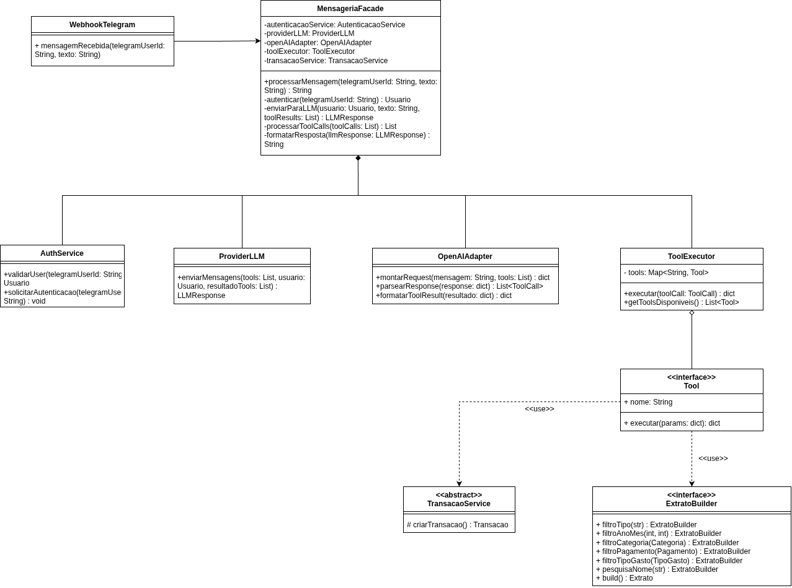
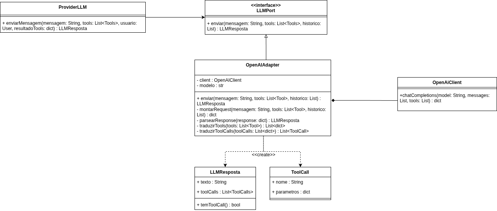

# 3.2. Módulo Padrões de Projeto GoFs Estruturais

## Introdução

Padrões de Projeto Estruturais (GoF) tratam da **composição de classes e objetos** para formar estruturas maiores e mais flexíveis. Enquanto os padrões criacionais se preocupam com *como* os objetos são criados, os estruturais se preocupam com *como* os objetos são organizados e conectados entre si. Segundo Gamma et al. (1994), os padrões estruturais "descrevem maneiras de compor objetos para obter novas funcionalidades", permitindo que sistemas complexos sejam construídos a partir de peças menores e independentes.

No contexto do projeto **Finanças**, dois padrões estruturais se destacam pela aderência direta à arquitetura modelada nos diagramas da Entrega 02:

- **Facade** — para simplificar o fluxo complexo de mensageria envolvendo 6 participantes (visíveis no Diagrama de Sequência).
- **Adapter** — para isolar a tradução entre a interface da API da OpenAI e o domínio financeiro do sistema.

---

## Metodologia

A escolha dos padrões estruturais seguiu um processo de análise em três etapas:

1. **Identificação de complexidade:** Foi analisado os diagramas de Sequência e Atividades para encontrar fluxos com múltiplos participantes e decisões encadeadas — candidatos naturais para o padrão Facade.
2. **Identificação de interfaces incompatíveis:** Foi analisado o Diagrama de Componentes e o Backlog para encontrar pontos onde o domínio do sistema (Transações, Categorias) precisa se comunicar com APIs externas com formato próprio (OpenAI) — candidato para o padrão Adapter.
3. **Modelagem e implementação:** Para cada padrão, foi produzido o diagrama UML de classes seguido da implementação em Python, garantindo que ambos os níveis (modelagem e código) estejam alinhados.

---

## Facade

### O que é o padrão?

O **Facade** (Fachada) é um padrão estrutural que fornece uma **interface simplificada** para um subsistema complexo. Ele não adiciona funcionalidade nova — apenas organiza e orquestra as chamadas entre múltiplos objetos, escondendo a complexidade atrás de um único ponto de acesso.

### Problema no projeto

O fluxo de mensageria do Telegram é o fluxo mais complexo do sistema. O Diagrama de Sequência mostra **6 participantes** interagindo em sequência:

1. **Ator** (usuário do Telegram)
2. **`:ProviderMensageria`** (webhook do Telegram)
3. **`<<Banco de Dados>> :Usuarios`** (validação/autenticação)
4. **`:ProviderLLM`** (comunicação com a IA)
5. **`<<service>> OpenAI API`** (serviço externo)
6. **`:Tools`** (execução de tools com loop de function calling)

O código cliente (webhook do Telegram) **não deveria conhecer** todos esses subsistemas, suas interfaces e a ordem correta de chamada entre eles. Sem a Facade, o webhook ficaria acoplado a 5 classes diferentes e conteria toda a lógica de orquestração.

### Subsistemas identificados nos diagramas

| # | Subsistema (Diagrama de Componentes) | Responsabilidade (Diagrama de Sequência) |
|---|-------------------------------------|------------------------------------------|
| 1 | Autenticação (subsistema WebSite) | `validarUser()` → verifica se o usuário existe no BD |
| 2 | `<<Banco de Dados>> :Usuarios` | `devolveUser()` → retorna dados do usuário |
| 3 | `:ProviderLLM` (subsistema IA) | `enviarMensagens(tools, usuario, resultado_tools)` → chama OpenAI |
| 4 | `<<service>> OpenAI API` | Serviço externo que interpreta mensagens e retorna tool_calls |
| 5 | `:Tools` (subsistema IA) | `executar()` → executa as tools e `retornar()` → devolve resultados |

### Fluxo completo extraído do Diagrama de Atividades

1. Usuário envia mensagem → **Usuário Autenticado?**
2. Se **Não** → Solicitar Autenticação → Informar ID
3. Se **Sim** → Preparar mensagens + Tools → Enviar para ProviderLLM
4. ProviderLLM interpreta → **Há tools para executar?**
5. Se **Sim** → Executar tools → Retornar resultado + mensagem → (volta ao passo 4, loop)
6. Se **Não** → Formatar resposta final → Retornar ao usuário

### Modelagem — Diagrama de Classes

O diagrama abaixo mostra a `MensageriaFacade` como ponto único de acesso, agregando todos os subsistemas. O código cliente (`WebhookTelegram`) depende **apenas** da Facade. Apresenta também a integração entre os outros padrões GoF.

<div align="center">



<b>Imagem 1:</b> Diagrama de Classes — Padrão Facade aplicado ao fluxo de mensageria

</div>

**Participantes do padrão no diagrama:**

| Participante GoF | Classe no Projeto | Responsabilidade |
|-----------------|-------------------|------------------|
| **Facade** | `MensageriaFacade` | Interface simplificada: `processarMensagem(telegramUserId, texto)` |
| **Subsistema 1** | `AuthService` | Validar e autenticar o usuário do Telegram |
| **Subsistema 2** | `ProviderLLM` | Enviar mensagens para o LLM com contexto de tools e resultados |
| **Subsistema 3** | `OpenAIAdapter` | Traduzir entre o domínio e o formato da API OpenAI (GoF Adapter) |
| **Subsistema 4** | `ToolExecutor` | Executar as tools retornadas pelo LLM |
| **Cliente** | `WebhookTelegram` | Recebe a mensagem e chama apenas `facade.processarMensagem()` |

### Senso crítico

A **Facade** foi escolhida porque o fluxo de mensageria do Telegram é comprovadamente complexo — os diagramas de Sequência e Atividades evidenciam **6 participantes** e **múltiplos nós de decisão** (autenticação, loop de tools). Sem a Facade, o webhook do Telegram teria dependências diretas com `AuthService`, `ProviderLLM`, `OpenAIAdapter`, `ToolExecutor` e `TransacaoService`, violando o princípio de responsabilidade única e dificultando a manutenção.

### Implementação

A implementação reside nos apps Django [`apps/provider_mensageria`](https://github.com/UnBArqDsw2026-1-Turma02/2026.01-T02_G8_Financas_Entrega_03) e [`apps/provider_llm`](https://github.com/UnBArqDsw2026-1-Turma02/2026.01-T02_G8_Financas_Entrega_03), mantendo o mapeamento 1-para-1 com os participantes do padrão: a **Facade** é a classe `MensageriaFacade`, que expõe o método único `processar_mensagem(telegram_user_id, texto) → str`; o **Cliente** é a view `WebhookTelegram`, que depende **apenas** da Facade e não conhece nenhum dos subsistemas; e cada **Subsistema** continua isolado em seu próprio módulo (`AuthService`, `ProviderLLM`, `OpenAIAdapter` e `ToolExecutor`/`ToolRegistry`), podendo ser substituído sem afetar o cliente. Os arquivos correspondentes são:

- `backend/apps/provider_mensageria/services/mensageria_facade.py` — **Facade** (`MensageriaFacade`)
- `backend/apps/provider_mensageria/services/auth_service.py` — Subsistema 1 (`AuthService`, com `validar_user`)
- `backend/apps/provider_llm/services/provider_llm.py` — Subsistema 2 (`ProviderLLM`, loop de *function calling*)
- `backend/apps/provider_llm/adapters/openai_adapter.py` — Subsistema 3 (`OpenAIAdapter`, ponte com o GoF Adapter)
- `backend/apps/provider_llm/services/tool_executor.py` — Subsistema 4 (`ToolExecutor`, executor das tools)
- `backend/apps/provider_mensageria/api/views.py` — Cliente (`WebhookTelegram`)

A Facade concentra três responsabilidades de orquestração que, sem ela, vazariam para o webhook: (1) consultar o `AuthService` e retornar uma mensagem padrão quando o `telegram_user_id` ainda não está vinculado a um `Usuario`; (2) instanciar um `ToolRegistry` amarrado ao usuário autenticado e envolvê-lo em um `ToolExecutor` callable; (3) chamar `ProviderLLM.conversar(...)` passando a mensagem, os *schemas* das tools e o executor — deixando o loop de *function calling* (LLM ↔ tools) inteiramente dentro do subsistema de IA. Os subsistemas são injetados no construtor, o que permite substituí-los por *fakes* nos testes unitários sem mexer no fluxo.

#### Uso pelo cliente

O `WebhookTelegram` recebe o `POST` do Telegram, extrai apenas `telegram_user_id` e `texto` do payload e delega o restante para `MensageriaFacade.processar_mensagem` — nenhum subsistema é referenciado na view:

```python
# WebhookTelegram (cliente) — depende APENAS da Facade
class WebhookTelegram(View):
    facade_cls = MensageriaFacade

    def post(self, request):
        payload = json.loads(request.body)
        message = payload.get("message") or {}
        telegram_user_id = (message.get("chat") or {}).get("id")
        texto = message.get("text") or ""

        resposta = self.facade_cls().processar_mensagem(
            telegram_user_id=str(telegram_user_id),
            texto=texto,
        )
        return JsonResponse({"ok": True, "resposta": resposta})


# MensageriaFacade — orquestra os 4 subsistemas
class MensageriaFacade:
    def processar_mensagem(self, telegram_user_id, texto):
        usuario = self._auth.validar_user(telegram_user_id)           # Subsistema 1
        if usuario is None:
            return self.MSG_NAO_AUTENTICADO

        registry = self._registry_factory(usuario=usuario)            # Subsistema 4
        executor = self._executor_factory(registry)
        resposta = self._provider.conversar(                          # Subsistemas 2 + 3
            mensagem=texto,
            tools=registry.schemas(),
            tool_executor=executor,
        )
        return resposta.conteudo or ""
```

---

## Adapter

### O que é o padrão?

O **Adapter** (Adaptador) é um padrão estrutural que permite que **interfaces incompatíveis trabalhem juntas**. Ele age como um tradutor entre duas interfaces que não poderiam se comunicar diretamente, convertendo a interface de uma classe na interface esperada pelo cliente.

### Problema no projeto

O sistema Finanças precisa se comunicar com a **API da OpenAI** para o fluxo de IA (function calling). Porém, a API da OpenAI trabalha com um formato JSON específico (`messages`, `tool_calls`, `function` objects), enquanto o domínio do sistema trabalha com entidades como `Transacao`, `ToolCall`, `LLMResposta`, etc.

**Sem o Adapter**, o código do domínio ficaria poluído com detalhes de serialização/deserialização da API externa, tornando impossível trocar o provedor de LLM sem alterar todo o sistema.

O Backlog (Feature 5.1.1) descreve explicitamente essas responsabilidades:
- *"Montar o JSON estruturado"* para enviar à OpenAI
- *"Fazer o parsing da resposta JSON da OpenAI"* para extrair tool calls

### Modelagem — Diagrama de Classes

O diagrama abaixo mostra o `OpenAIAdapter` implementando a interface `LLMPort`, servindo como ponte entre o `ProviderLLM` (cliente) e o `OpenAiClient` (serviço adaptado).

<div align="center">



<b>Imagem 2:</b> Diagrama de Classes — Padrão Adapter aplicado à integração com a OpenAI

</div>

**Participantes do padrão no diagrama:**

| Participante GoF | Classe no Projeto | Responsabilidade |
|-----------------|-------------------|------------------|
| **Target** (interface alvo) | `<<interface>> LLMPort` | Define a interface que o domínio espera: `enviar(mensagem, tools, historico) → LLMResposta` |
| **Adapter** | `OpenAIAdapter` | Implementa `LLMPort`, traduz entre o domínio e o formato da OpenAI |
| **Adaptee** (serviço adaptado) | `OpenAiClient` | API real da OpenAI com `chatCompletions(model, messages, tools)` |
| **Client** | `ProviderLLM` | Usa a interface `LLMPort` sem saber que a implementação é OpenAI |
| **Produtos criados** | `LLMResposta`, `ToolCall` | Objetos do domínio criados pelo Adapter a partir da resposta da OpenAI |


### Senso crítico

O **Adapter** é essencial neste projeto porque a comunicação com a OpenAI é um **ponto de acoplamento externo** — a API pode mudar sua interface, ou o projeto pode migrar para outro LLM (ex: Anthropic, Gemini, Llama). Com o Adapter:

- O domínio **nunca referencia** a API da OpenAI diretamente
- Para trocar de LLM, basta criar um novo Adapter (ex: `GeminiAdapter`) que implemente `LLMPort`

### Implementação

A implementação reside no app Django [`apps/provider_llm`](https://github.com/UnBArqDsw2026-1-Turma02/2026.01-T02_G8_Financas_Entrega_03) e mapeia 1-para-1 com os participantes do padrão: o **Target** é a ABC `LLMPort`, o **Adapter** é a classe `OpenAIAdapter`, o **Adaptee** é o wrapper `OpenAiClient` (que encapsula o SDK oficial `openai`), e o **Client** é o serviço `ProviderLLM`, que recebe um `LLMPort` por injeção de dependência e implementa o loop de *function calling*. Os produtos do domínio (`LLMResposta`, `ToolCall`) são dataclasses construídas pelo Adapter a partir da resposta nativa da OpenAI. Os arquivos correspondentes são:

- `backend/apps/provider_llm/domain.py` — Produtos do domínio (`LLMResposta`, `ToolCall`)
- `backend/apps/provider_llm/ports/llm_port.py` — Target (interface `LLMPort`)
- `backend/apps/provider_llm/clients/openai_client.py` — Adaptee (wrapper do SDK `openai`)
- `backend/apps/provider_llm/adapters/openai_adapter.py` — Adapter (`OpenAIAdapter`)
- `backend/apps/provider_llm/services/provider_llm.py` — Client (`ProviderLLM`)

O Adapter concentra duas traduções: na ida, converte tools no vocabulário do domínio (`{"nome", "descricao", "parametros"}`) para o *schema* de *function calling* esperado pela OpenAI (`{"type": "function", "function": {...}}`); na volta, lê o `ChatCompletion` retornado pelo SDK e produz um `LLMResposta` com `ToolCall`s já com argumentos JSON parseados, escondendo qualquer detalhe específico do provedor.

#### Uso pelo cliente

O `ProviderLLM` declara o tipo estático como `LLMPort` (a abstração) e nunca importa nada do pacote `openai` — para trocar de provedor, basta substituir o Adapter concreto na injeção.

```python
# Configuração — única linha que conhece a OpenAI
llm: LLMPort = OpenAIAdapter(OpenAiClient(model="gpt-4o-mini"))
provider = ProviderLLM(llm)

# Uso pelo cliente — apenas vocabulário do domínio
resposta = provider.conversar(
    mensagem="Gastei 30 reais no almoço hoje",
    tools=[
        {
            "nome": "criar_saida",
            "descricao": "Registra uma saída financeira",
            "parametros": {
                "type": "object",
                "properties": {
                    "valor": {"type": "number"},
                    "nome": {"type": "string"},
                },
                "required": ["valor", "nome"],
            },
        }
    ],
    tool_executor=lambda tc: executar_tool(tc.nome, tc.argumentos),
)

# resposta.conteudo         → texto final em linguagem natural
# resposta.tool_calls       → lista de ToolCall (vocabulário do domínio)
# resposta.tem_tool_calls   → False quando o loop terminou
```

Para migrar para outro LLM (ex.: Anthropic), basta criar `AnthropicAdapter(LLMPort)` e trocar a linha de configuração — nenhuma outra parte do sistema precisa mudar.

---

## Referências

1. GAMMA, E. et al. **Design Patterns: Elements of Reusable Object-Oriented Software**. Addison-Wesley, 1994.

2. REFACTORING GURU. **Facade**. Disponível em: [https://refactoring.guru/design-patterns/facade](https://refactoring.guru/design-patterns/facade). Acesso em: 12 maio 2026.

3. REFACTORING GURU. **Adapter**. Disponível em: [https://refactoring.guru/design-patterns/adapter](https://refactoring.guru/design-patterns/adapter). Acesso em: 12 maio 2026.

---

## Histórico de Versões

| Versão | Data | Descrição | Autor(es) |
|--------|------|-----------|-----------|
| 1.0 | 12/05/2026 | Criação do documento com os padrões Facade e Adapter | Equipe G8 |
| 1.1 | 12/05/2026 | Adição da seção *Implementação* do Adapter (Issue #15) | Equipe G8 |
| 1.2 | 13/05/2026 | Adição da seção *Implementação* da Facade (Issue #16) | Equipe G8 |